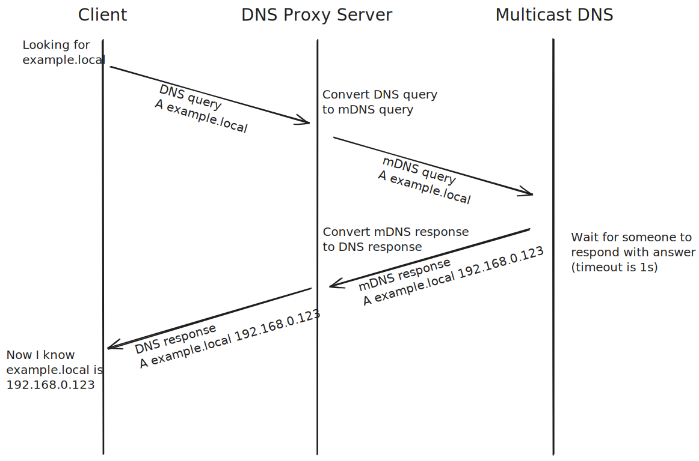

# DNS Proxy Server mDNS resolver

Simple DNS Server which proxy queries to mDNS and returning answers back.

## Deprecation notice

I've switched to systemd-resolced with LLMNR and MDNS turned on, this solves all my use cases. as well I've setup AdGuardHome to resolve all ".local" domains via stub resolver (127.0.0.53).

## Use cases

- Use in combination with [`dnsproxy`] or [`AdGuardHome`] in order to provide ability resolve mDNS hosts by client that support only classic DNS (mostly old Android version)

## Usage

### Dependencies:

- dnslib

### Command line options

| Option            | Default value          | Description                             |
|-------------------|------------------------|-----------------------------------------|
| `--port`, `-p`    | `5053`                 | Local proxy port                        |
| `--address`, `-a` | `` (means any address) | Local proxy listen address              |
| `--log`           | `false`                | Log hooks to enable                     |
| `--log-prefix`    | `false`                | Log prefix (timestamp/handler/resolver) |

## How it works

[`dnsproxy`]: https://github.com/AdguardTeam/dnsproxy
[`AdGuardHome`]: https://github.com/AdguardTeam/AdGuardHome
